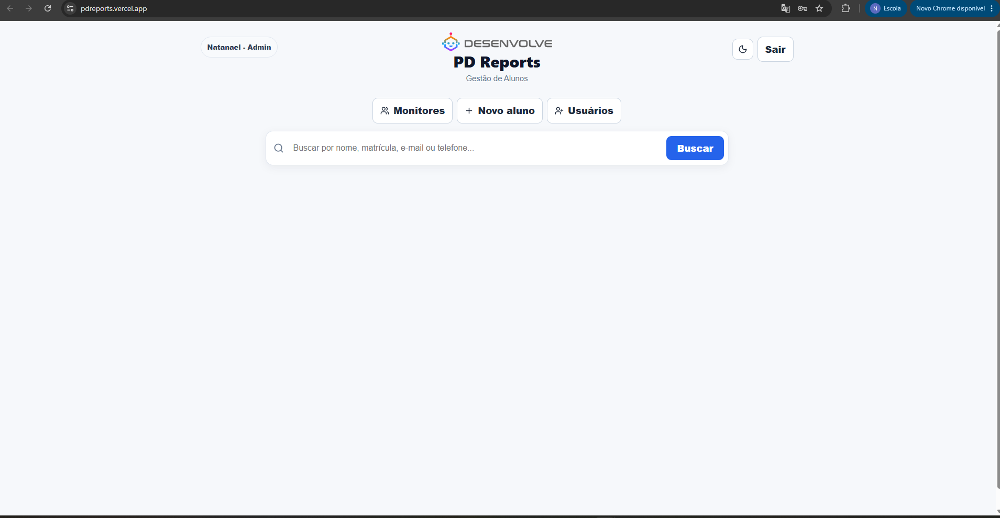
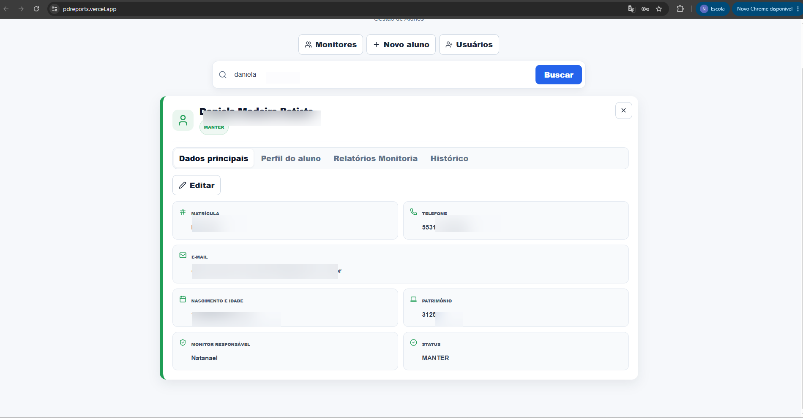
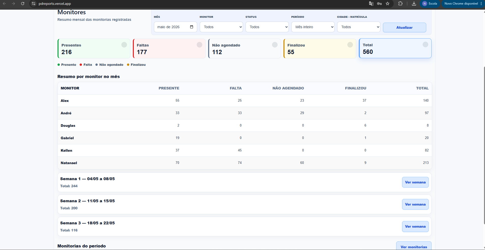

# PD Reports

Sistema web para gestão e acompanhamento de alunos, monitores, perfis, relatórios de monitoria e indicadores mensais.


---

## Demo

🌐 Aplicação online:

**https://pdreports.vercel.app**

> O backend está hospedado no plano gratuito do Render. O primeiro acesso após períodos sem uso pode levar alguns segundos devido ao cold start.

---

## Sobre o projeto

PD Reports é um sistema web desenvolvido para centralizar a gestão de alunos, monitorias e indicadores internos.

O sistema permite:

- gerenciamento de alunos
- acompanhamento de monitorias
- controle por monitor responsável
- indicadores mensais
- perfis de acesso
- sincronização com Google Sheets
- relatórios históricos

Foi construído com arquitetura separada entre frontend, backend, banco de dados e integrações externas.

---

## Tecnologias

### Frontend

- React
- Vite
- CSS
- Lucide React
- Vercel

### Backend

- Python
- Flask
- Gunicorn
- PostgreSQL
- psycopg2
- Google Sheets API
- Render

### Banco de dados

- Neon PostgreSQL

### Integrações

- Google Sheets API

---

## Funcionalidades

✅ Login e autenticação

✅ Gestão de alunos

✅ Perfil detalhado do aluno

✅ Histórico individual

✅ Relatórios de monitoria

✅ Dashboard administrativo

✅ Indicadores por:

- mês
- monitor
- status
- cidade/matrícula

✅ Gestão de usuários

✅ Controle de permissões:

- Admin
- Monitor
- Psicóloga

✅ Integração automática com Google Sheets

✅ Modo claro/escuro

---

## Screenshots

### Login


### Dashboard de Monitorias



### Perfil do aluno



### Gestão e Monitorias



---

## Arquitetura

Estrutura utilizada em produção:

```text
Frontend (Vercel)
        ↓
Backend API (Render)
        ↓
PostgreSQL (Neon)
        ↓
Google Sheets API
```

Estrutura do projeto:

```text
pd-reports/
├── frontend/
│   └── React + Vite
│
├── backend/
│   └── Flask + PostgreSQL + integrações
│
├── docs/
│   ├── images/
│   └── SETUP_LOCAL.md
│
└── README.md
```

---

## Dados de demonstração

Os dados exibidos nesta versão pública foram anonimizados ou substituídos por exemplos fictícios para preservar privacidade e confidencialidade.

---

## Variáveis de ambiente

### Backend

```env
DATABASE_URL=
ADMIN_PASSWORD=
GOOGLE_SHEETS_ID=
GOOGLE_SERVICE_ACCOUNT_JSON=
GOOGLE_SERVICE_ACCOUNT_FILE=google-service-account.json
FRONTEND_URL=https://pdreports.vercel.app
INTEGRALIZACAO_XLSX_PATH=dados/alunos_horas_extras_com_desafio_final.xlsx
INTEGRALIZACAO_HORAS_TOTAIS=154
INTEGRALIZACAO_PRAZO_FINAL=2026-11-30
CONSUMPTION_PROCESSING_MODE=external
```

### Frontend

```env
VITE_API_URL=https://sistema-alunos-mwkw.onrender.com
```

---

## Executando localmente

Documentação detalhada:

📄 `docs/SETUP_LOCAL.md`

### Backend

```bash
cd backend

python -m venv .venv

.venv\Scripts\activate

pip install -r requirements.txt

python app.py
```

### Frontend

```bash
cd frontend

npm install

npm run dev
```

---

## Deploy

### Backend (Render)

Configuração:

- Root Directory: `backend`
- Build Command:

```bash
pip install -r requirements.txt
```

- Start Command:

```bash
gunicorn wsgi:app --timeout 1200
```

Variáveis:

```env
DATABASE_URL=
ADMIN_PASSWORD=
GOOGLE_SHEETS_ID=
GOOGLE_SERVICE_ACCOUNT_JSON=
FRONTEND_URL=https://pdreports.vercel.app
CONSUMPTION_PROCESSING_MODE=sync
```

O timeout de 1200 segundos suporta a atualizacao manual do consumo no proprio Web Service do Render. O modo `external` continua disponivel como fallback com `python backend/scripts/processar_atualizacao_consumo_pendente.py`.

---

### Frontend (Vercel)

Configuração:

- Framework: Vite
- Root Directory: `frontend`
- Build Command:

```bash
npm run build
```

- Output Directory:

```bash
dist
```

Variável:

```env
VITE_API_URL=https://sistema-alunos-mwkw.onrender.com
```

---

## Segurança

- Permissões validadas no backend
- CORS restrito por `FRONTEND_URL`
- Controle de perfis por usuário
- Arquivos `.env` não versionados
- Credenciais protegidas por variáveis de ambiente
- JSON de conta de serviço fora do repositório

---

## Scripts úteis

Local:

```bash
cd backend
```

Scripts disponíveis:

- corrigir_nomes.py
- corrigir_telefones.py
- criar_usuarios_monitores.py
- importar_perfil_alunos.py
- testar_permissoes.py
- testar_sync_sheets.py

Exemplo:

```bash
python scripts/corrigir_nomes.py
```

---

## Validação antes de deploy

### Backend

```bash
python -m py_compile app.py

python -m py_compile wsgi.py
```

### Frontend

```bash
npm run build

npm run lint
```

---

## Boas práticas utilizadas

- Commits pequenos e organizados
- Separação frontend/backend
- Controle por ambiente
- Integração desacoplada com Google Sheets
- Deploy independente
- Logs para depuração
- Controle de permissões no backend

---

## Licença

Projeto disponibilizado para fins educacionais e demonstração de portfólio.
