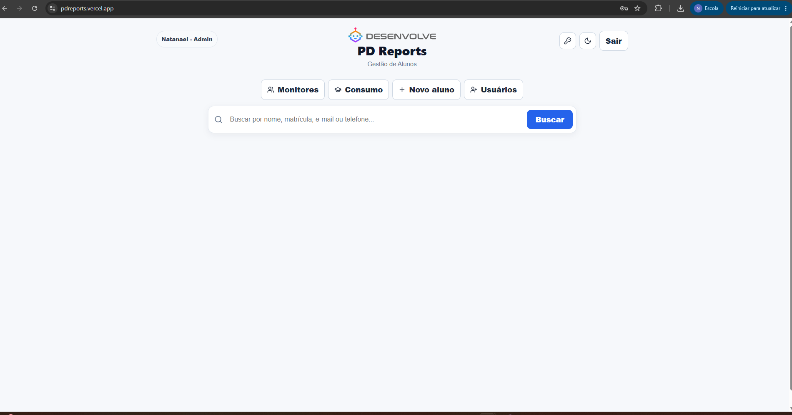

# PD Reports

Sistema web para gestão acadêmica, acompanhamento de alunos, relatórios de monitoria e controle de consumo dos cursos do Projeto Desenvolve.


---

## Demo

Aplicação online:

**https://pdreports.vercel.app**

> O backend está hospedado no plano gratuito do Render. O primeiro acesso após períodos sem uso pode levar alguns segundos por causa do cold start.

---

## Sobre o projeto

PD Reports centraliza a operação de acompanhamento do Projeto Desenvolve em uma aplicação administrativa com autenticação, perfis de acesso, gestão de alunos, histórico individual, relatórios de monitoria e um módulo completo de Consumo.

O sistema foi construído com frontend e backend separados, persistência em PostgreSQL/Neon, integração com Google Sheets e deploy independente em Vercel e Render. A versão pública usa dados fictícios ou anonimizados para preservar informações sensíveis.

---

## Funcionalidades

### Gestão acadêmica

- Cadastro, consulta e edição de alunos
- Perfil individual com dados principais e informações complementares
- Histórico de alterações por aluno
- Monitor responsável, status acadêmico e filtros por matrícula/cidade

### Monitoria

- Relatórios de monitoria
- Indicadores mensais por presença, falta, não agendado e finalização
- Dashboard por monitor, status, período e cidade

### Consumo e certificação

- Painel geral de consumo dos alunos
- Perfil individual de progresso por curso
- Controle de certificados gerados
- Contadores de cursos concluídos, em andamento, não iniciados e sem certificado
- Regra oficial de 22 cursos certificáveis
- Exclusão do curso `Intensivão Desenvolve 2025`
- Tratamento especial para alunos com Desafio Final
- Meta diária de estudo até o prazo final
- Atualização manual pelo painel administrativo usando `all_grades.json` e CSV de certificados

### Administração e segurança

- Login com perfis de acesso
- Gestão de usuários
- Permissões por papel no frontend e no backend
- Escopos municipais por matrícula
- Acesso específico para Prefeitura Itabira (`PDITA`) e Prefeitura Bom Despacho (`PDBD`)
- Validações de autorização antes de consultas, edições, histórico, monitorias e consumo

### Integrações e infraestrutura

- Google Sheets API
- PostgreSQL/Neon
- Deploy do frontend na Vercel
- Deploy da API Flask no Render
- Processamento síncrono de atualização de Consumo no Render
- Fallback administrativo para processamento externo de runs pendentes
- Modo claro/escuro

---

## Módulo de Consumo

O módulo de Consumo acompanha o progresso dos alunos nos cursos da trilha oficial, cruzando dados de progresso, certificados emitidos e vínculos com os alunos cadastrados no PD Reports.

Principais recursos:

- visão geral com alunos ativos, inativos, todos e não vinculados;
- abertura do perfil individual diretamente pela lista de Consumo;
- atualização manual pelo painel administrativo;
- processamento síncrono no Render com persistência no Neon PostgreSQL;
- leitura do `all_grades.json` para progresso e do CSV de certificados para certificados emitidos;
- catálogo oficial de 22 cursos certificáveis;
- inclusão automática de cursos oficiais ainda não iniciados como `0%`;
- separação entre curso concluído e certificado gerado;
- regra especial para alunos com Desafio Final, sem inventar certificados individuais;
- ordenação da lista de cursos sem certificado por progresso e depois por nome;
- cálculo de meta diária até o prazo final configurado;
- filtros e permissões por escopo municipal.

---

## Screenshots

### Login e autenticação


### Dashboard administrativo



### Aba de Consumo


### Atualização do Consumo


Fluxo administrativo para envio do arquivo `all_grades.json` e do CSV de certificados gerados pelo checker, permitindo atualizar os indicadores de consumo, certificação e progresso dos alunos diretamente pelo painel.

### Consumo Individual


### Meta Diária 


### Consumo Desafio Final


### Busca por Aluno


### Aba de Controle de Monitorias


---

## Tecnologias

### Frontend

- React
- Vite
- CSS
- Lucide React
- Vercel

### Backend

- Python
- Flask
- Gunicorn
- PostgreSQL
- psycopg2
- Google Sheets API
- Render

### Banco de dados

- Neon PostgreSQL

---

## Arquitetura

Estrutura utilizada em produção:

```text
Frontend (Vercel)
        |
Backend API (Render)
        |
PostgreSQL (Neon)
        |
Google Sheets API
```

Estrutura do projeto:

```text
pd-reports/
├── frontend/
│   └── React + Vite
│
├── backend/
│   └── Flask + PostgreSQL + integrações
│
├── docs/
│   ├── images/
│   ├── ATUALIZACAO_CONSUMO.md
│   ├── PERMISSOES_CIDADE.md
│   └── SETUP_LOCAL.md
│
└── README.md
```

---

## Dados de demonstração

Os dados exibidos nesta versão pública foram anonimizados ou substituídos por exemplos fictícios para preservar privacidade e confidencialidade.

---

## Variáveis de ambiente

### Backend

```env
DATABASE_URL=
ADMIN_PASSWORD=
GOOGLE_SHEETS_ID=
GOOGLE_SERVICE_ACCOUNT_JSON=
GOOGLE_SERVICE_ACCOUNT_FILE=google-service-account.json
FRONTEND_URL=https://pdreports.vercel.app
INTEGRALIZACAO_XLSX_PATH=dados/alunos_horas_extras_com_desafio_final.xlsx
INTEGRALIZACAO_HORAS_TOTAIS=154
INTEGRALIZACAO_PRAZO_FINAL=2026-11-30
CONSUMPTION_PROCESSING_MODE=sync
COURSE_CONSUMPTION_TOTAL_CERTIFIABLE=22
```

### Frontend

```env
VITE_API_URL=https://sistema-alunos-mwkw.onrender.com
```

---

## Executando localmente

Documentação detalhada:

`docs/SETUP_LOCAL.md`

### Backend

```bash
cd backend
python -m venv .venv
.venv\Scripts\activate
pip install -r requirements.txt
python app.py
```

### Frontend

```bash
cd frontend
npm install
npm run dev
```

---

## Deploy

### Backend (Render)

Configuração:

- Root Directory: `backend`
- Build Command:

```bash
pip install -r requirements.txt
```

- Start Command:

```bash
gunicorn wsgi:app --timeout 1200
```

Variáveis principais:

```env
DATABASE_URL=
ADMIN_PASSWORD=
GOOGLE_SHEETS_ID=
GOOGLE_SERVICE_ACCOUNT_JSON=
FRONTEND_URL=https://pdreports.vercel.app
CONSUMPTION_PROCESSING_MODE=sync
```

O timeout de 1200 segundos suporta a atualização manual do Consumo no próprio Web Service do Render. O modo `external` continua disponível como fallback com:

```bash
python backend/scripts/processar_atualizacao_consumo_pendente.py
```

### Frontend (Vercel)

Configuração:

- Framework: Vite
- Root Directory: `frontend`
- Build Command:

```bash
npm run build
```

- Output Directory:

```bash
dist
```

Variável:

```env
VITE_API_URL=https://sistema-alunos-mwkw.onrender.com
```

---

## Segurança

- Permissões validadas no backend
- CORS restrito por `FRONTEND_URL`
- Controle de perfis por usuário
- Escopos municipais para Itabira e Bom Despacho
- Arquivos `.env` não versionados
- Credenciais protegidas por variáveis de ambiente
- JSON de conta de serviço fora do repositório
- Dados públicos anonimizados ou fictícios

---

## Scripts úteis

Execute a partir da raiz do projeto, salvo indicação contrária.

### Validação e testes

```bash
python backend/scripts/testar_course_checker.py
python backend/scripts/testar_integralizacao.py
python backend/scripts/testar_permissoes.py
python backend/scripts/testar_permissoes_cidade.py
python backend/scripts/testar_upload_consumo.py
```

### Consumo

```bash
python backend/scripts/processar_atualizacao_consumo_pendente.py
python backend/scripts/diagnosticar_vinculos_consumo.py
python backend/scripts/processar_consumo_checker.py
python backend/scripts/importar_relatorio_checker_xlsx.py
```

### Operação e manutenção

```bash
python backend/scripts/aplicar_migrations.py
python backend/scripts/check_env.py
python backend/scripts/corrigir_nomes.py
python backend/scripts/corrigir_telefones.py
python backend/scripts/criar_usuarios_monitores.py
python backend/scripts/importar_perfil_alunos.py
```

---

## Validação antes de deploy

### Backend

```bash
python -m py_compile backend/app.py backend/access_scope.py backend/course_checker.py backend/checker_report_importer.py backend/integralizacao.py
python backend/scripts/testar_course_checker.py
python backend/scripts/testar_integralizacao.py
python backend/scripts/testar_permissoes.py
python backend/scripts/testar_permissoes_cidade.py
```

### Frontend

```bash
npm --prefix frontend run build
```

### Qualidade do diff

```bash
git diff --check
```

---

## Documentação complementar

- `docs/SETUP_LOCAL.md`
- `docs/ATUALIZACAO_CONSUMO.md`
- `docs/PERMISSOES_CIDADE.md`

---

## Boas práticas utilizadas

- Separação entre frontend e backend
- Controle por ambiente
- Integração desacoplada com Google Sheets
- Persistência relacional no Neon PostgreSQL
- Deploy independente
- Logs e scripts de diagnóstico
- Controle de permissões no backend
- Testes de regras críticas de Consumo e permissões

---

## Licença

Projeto disponibilizado para fins educacionais e demonstração de portfólio.
